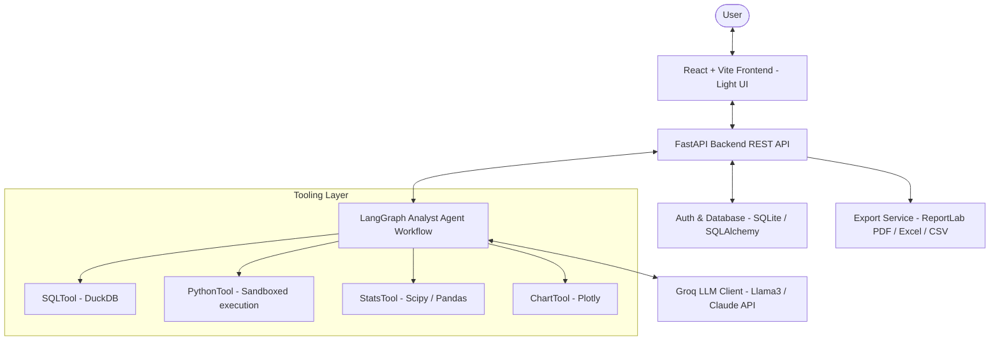

# 🤖 DataMind AI — Full-Stack AI Data Analyst Agent

> An autonomous, full-stack AI Data Analyst Agent built with **FastAPI**, **React + Vite**, **DuckDB**, **LangGraph**, **Plotly**, and **Groq LLM**. It allows users to upload CSV, Excel, or SQLite files and perform complete data analysis through natural language chat.

---

## 🌟 Architecture & Tech Stack



### Stack Components
- **Backend:** Python 3.14, FastAPI, DuckDB, LangGraph, SQLAlchemy (SQLite), Plotly, ReportLab, Scipy, Groq API client
- **Frontend:** React 18, Vite, Light White & Grey custom CSS design system, Zustand, Recharts, React-Syntax-Highlighter, Lucide Icons, Axios, React Hot Toast
- **Testing:** Pytest (100% test pass rate across 9 unit/integration test suites)

---

## ✨ Features Implemented

1. **Multi-Format Data Upload Zone:**
   - Supports `.csv`, `.xlsx`, `.xls`, `.sqlite`, `.db` files.
   - Drag-and-drop file upload with live schema parsing & sample previews.

2. **Autonomous LangGraph Agent Workflow:**
   - Dynamic 5-stage node pipeline:
     1. `planner_node`: Analyzes question & schema to decide standard tool (SQL, Python, Stats, Chart, or Insight).
     2. `verifier_node`: Checks SQL syntax via DuckDB `EXPLAIN` or verifies Python code safety against sandbox rules.
     3. `executor_node`: Executes SQL / Python on the dataset safely.
     4. `chart_node`: Automatically generates dynamic Plotly / Recharts visual charts based on query heuristics.
     5. `insight_node`: Generates human-readable executive summaries & data-driven insights in plain English.

3. **Sandboxed Code Execution:**
   - Custom `PythonTool` restricting dangerous modules/keywords (`os.system`, `subprocess`, `rmtree`, etc.).
   - `SQLTool` running in-memory DuckDB queries with instant speed and automatic type inference.

4. **Modern Light (White & Grey) Theme UI:**
   - Code syntax highlighting for SQL and Python snippets.
   - Interactive data tables with paging and cell truncation.
   - Recharts visual charts (Bar, Line, Pie, Scatter).
   - Agent reasoning trace view for full transparency into AI thought processes.

5. **Export & Reporting Engine:**
   - One-click export to **PDF Reports** (formatted via ReportLab with tables and key insights), **Excel**, and **CSV**.

6. **Authentication & Session History:**
   - JWT authentication + Guest Mode option.
   - Per-dataset query history tracking execution time and pass/fail statuses.

---

## ⚡ Quick Start

### 1. Prerequisites
- Python 3.10+
- Node.js 18+ & npm

### 2. Backend Setup
```bash
cd backend

# Install python dependencies
pip install -r requirements.txt

# Configure environment variables (.env)
cp .env.example .env
# Edit .env and set your GROQ_API_KEY

# Start FastAPI dev server
uvicorn main:app --reload --port 8000
```
- API Swagger Docs available at: `http://localhost:8000/docs`
- Health Check endpoint: `http://localhost:8000/health`

### 3. Frontend Setup
```bash
cd frontend

# Install node dependencies
npm install

# Start Vite dev server
npm run dev
```
- Open `http://localhost:5173` in your browser.

---

## 🧪 Testing

Run backend unit and integration test suite:
```bash
python -m pytest tests/ -v
```

Build production frontend bundle:
```bash
cd frontend
npm run build
```

---

## 📂 Project Structure

```
AI-Data-Analyst-Agent/
├── backend/
│   ├── api/routes/          # FastAPI routers (upload, chat, export, auth)
│   ├── agents/              # LangGraph analyst agent workflow
│   ├── tools/               # DuckDB SQL, Sandboxed Python, Stats, Chart tools
│   ├── database/            # SQLAlchemy database models & session setup
│   ├── models/              # Pydantic schemas & LLM client wrapper
│   ├── config.py            # App settings & environment loader
│   ├── main.py              # FastAPI entry point
│   └── requirements.txt     # Backend python requirements
├── frontend/
│   ├── src/
│   │   ├── api/             # Axios API client
│   │   ├── components/      # UI components (Chat, Upload, Dashboard, Sidebar)
│   │   ├── pages/           # AuthPage
│   │   ├── store/           # Zustand state management
│   │   ├── App.jsx          # React router setup
│   │   └── index.css        # Light UI (White & Grey) design system
│   └── package.json
├── tests/                   # Pytest test suite (test_api.py, test_tools.py)
├── uploads/                 # Sample & uploaded datasets
├── README.md                # Project documentation
└── .gitignore
```

---

## 📄 License

MIT License
